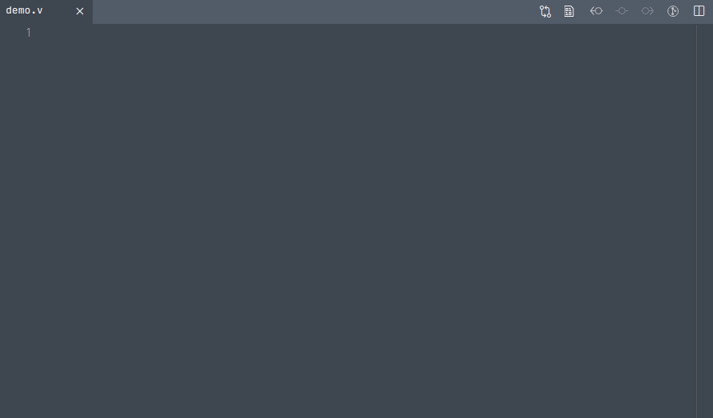

[](https://nim-lang.org)
[](https://opensource.org/licenses/MIT)


# vls
This tool is a Verilog IEEE 1364-2005 [language
server](https://microsoft.github.io/language-server-protocol/) written in
[Nim](https://nim-lang.org). The parsing is handled by the
[`vparse`](https://github.com/sthenic/vparse) library.



<sup>Visual Studio Code using the [`vls-vscode`](https://github.com/sthenic/vls-vscode) extension.</sup>

## Index

- [Supported protocol features](#supported-protocol-features)
- [Installation](#installation)
- [Editor integration](#editor-integration)
- [Configuration](#configuration)
- [Building](#building)
- [Version numbers](#version-numbers)
- [Reporting a bug](#reporting-a-bug)
- [License](#license)
- [Third-party dependencies](#third-party-dependencies)

## Supported protocol features

### Workspace
- [ ] workspace/executeCommand
- [x] workspace/configuration
- [x] workspace/didChangeConfiguration

### Text synchronization
- [x] textDocument/didChange
- [x] textDocument/didClose
- [x] textDocument/didOpen

### Language features
- [x] textDocument/completion
- [x] textDocument/hover
- [x] textDocument/signatureHelp
- [x] textDocument/declaration
- [x] textDocument/definition
- [x] textDocument/references
- [x] textDocument/documentHighlight
- [x] textDocument/documentSymbol
- [x] textDocument/rename

## Installation

1. Download the latest [release archive](https://github.com/sthenic/vls/releases)
   that targets your platform.

2. Extract the archive to a persistent location and make the binary file
   available on the system path.

   If you're on Linux and your distribution supports `.deb` packages, choosing
   that method (installing via `dpkg`) takes care of this for you.

3. Set up your editor (which will need to have a built-in language server
   client) to use `vls` as the language server for Verilog files. There's a few
   examples on how to do this in the section on [editor
   integration](#editor-integration).

If none of the release packages targets your platform, refer to
[this](#building) section for information on how to build the language server
from the source code.

### Updating

To update to a later release, perform steps 1 and 2 above. Make sure to replace
the old binary file (the `dpkg` method handles this for you).

## Editor integration

### Visual studio code

Install the [`vls-vscode`](https://github.com/sthenic/vls-vscode) extension.

### vim-lsp

https://github.com/prabirshrestha/vim-lsp

```vim
augroup vim_lsp_vls
    autocmd!
    autocmd User lsp_setup call lsp#register_server(
        \ {
        \ 'name': 'vls',
        \ 'cmd': {server_info->['vls', '--force-diagnostics']},
        \ 'whitelist': ['verilog'],
        \ })
augroup END
```

### vim-lsc

https://github.com/natebosch/vim-lsc

```vim
let g:lsc_server_commands['verilog'] = 'vls --force-diagnostics'
```

### nvim-lsp

https://github.com/hekwall/nvim-lsp

```lua
lua require 'nvim_lsp'.vls.setup {}
```

### Emacs ([lsp-mode](https://github.com/emacs-lsp/lsp-mode))

```lisp
(use-package lsp-mode
  :hook (verilog-mode . lsp)
  :commands lsp)


(use-package company-capf
  :config (push 'company-capf company-backends))


(use-package verilog-mode
  :defer t
  :config
  (require 'lsp)
  (lsp-register-client
   (make-lsp-client :new-connection (lsp-stdio-connection '("vls"))
   :major-modes '(verilog-mode)
   :priority -1
   ))
  :hook (verilog-mode . (lambda()
      (lsp)
      (flycheck-mode t)
      (add-to-list 'lsp-language-id-configuration '(verilog-mode . "verilog")))
```

### Emacs ([Eglot](https://github.com/joaotavora/eglot))

```lisp
(defun verilog-eglot-hook ()
  (company-mode)
  (yas-minor-mode 1)
  (eglot-ensure)
  (add-to-list 'eglot-server-programs '(verilog-mode . ("vls"))))
(add-hook 'verilog-mode-hook 'verilog-eglot-hook)
```

## Configuration

The language server is configured with a
[TOML](https://github.com/toml-lang/toml) file that's parsed by the
[`vltoml`](https://github.com/sthenic/vltoml) library.

When a text document is opened by the client (`textDocument/didOpen` request),
the server looks for a configuration file. The search process walks from the
directory of the input file up to the root directory looking for one of the
following files (listed in the order of precedence):

1. `.vl.toml`
2. `vl.toml`
3. `.vl/.vl.toml`
4. `.vl/vl.toml`
5. `vl/.vl.toml`
6. `vl/vl.toml`

In short, the configuration file can have two different names: `.vl.toml` or
`vl.toml` and can reside immediately on the ascended path, or inside a directory
named: `.vl/` or `vl/`. Refer to the README of the
[`vltoml`](https://github.com/sthenic/vltoml) library for information about the
structure and contents of the configuration file.

## Building

**The instructions below won't work until I've made the dependencies available via Nim's package manager.**

If none of the [release packages](https://github.com/sthenic/vls/releases)
targets your platform, you can still build and use this tool provided that
you have a C compiler that targets your platform.

1. Download and install the [Nim](https://nim-lang.org/install.html) compiler
   and its tools.

2. Clone this repository and run

       nimble install

   This will build the binary and add it to the path.

## Version numbers

Releases follow [semantic versioning](https://semver.org/) to determine how the
version number is incremented. If the specification is ever broken by a release,
this will be documented in the changelog.

## Reporting a bug

If you discover a bug or what you believe is unintended behavior, please submit
an issue on the [issue board](https://github.com/sthenic/vls/issues). A minimal
working example and a short description of the context is appreciated and goes a
long way towards being able to fix the problem quickly.

## License

This tool is free software released under the [MIT
license](https://opensource.org/licenses/MIT).

## Third-party dependencies

* [Nim's standard library](https://github.com/nim-lang/Nim)
* [`vparse`](https://github.com/sthenic/vparse)
* [`vltoml`](https://github.com/sthenic/vltoml)
